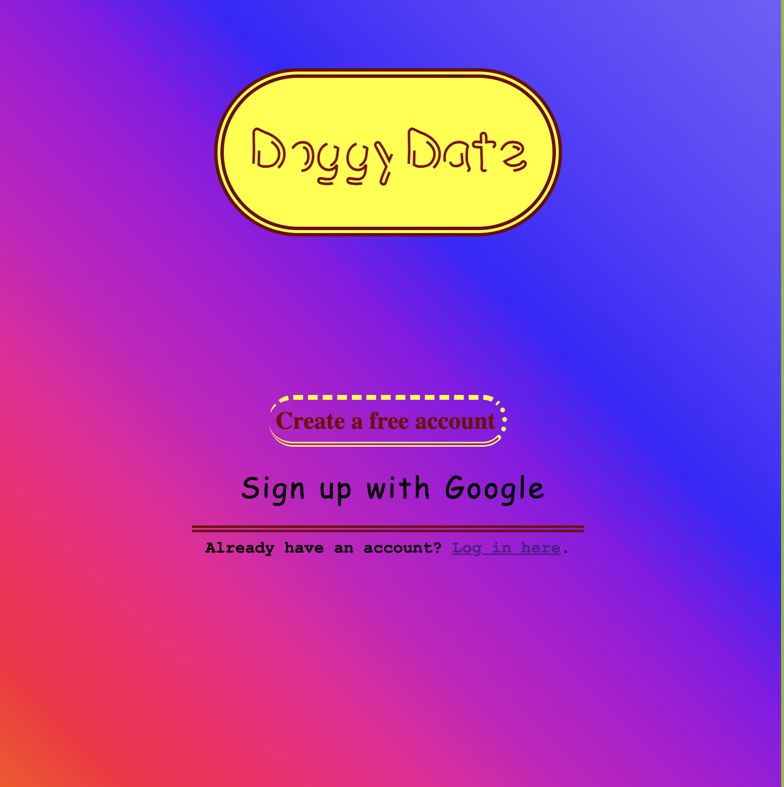
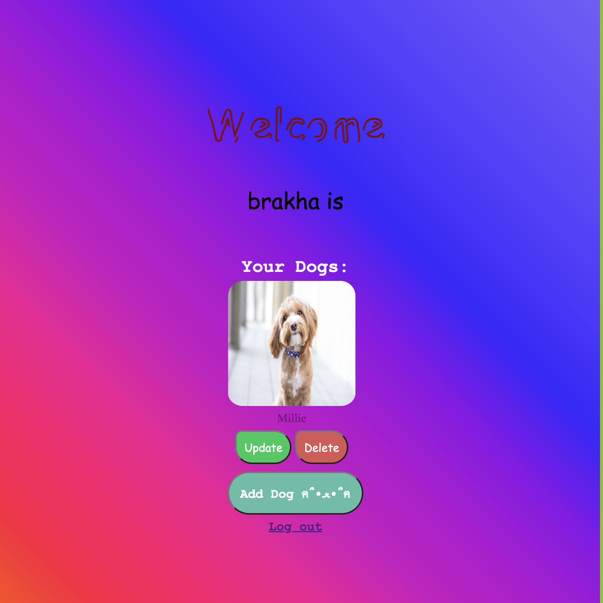
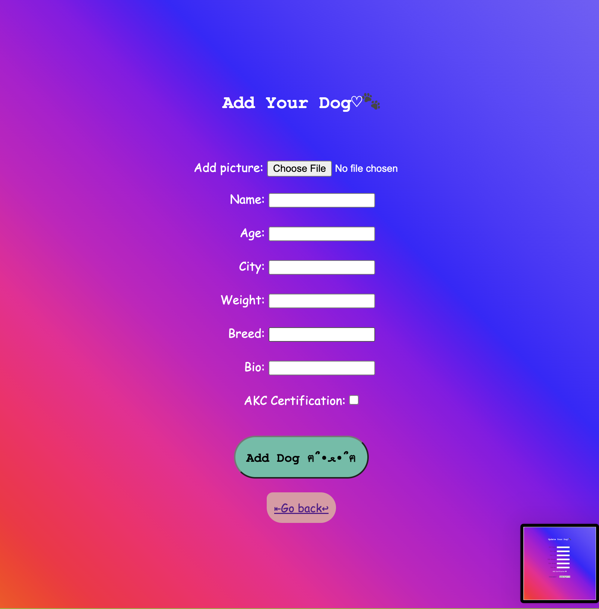
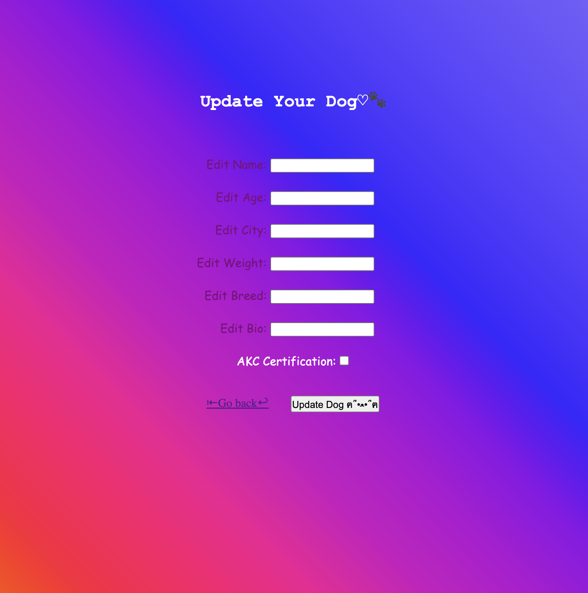
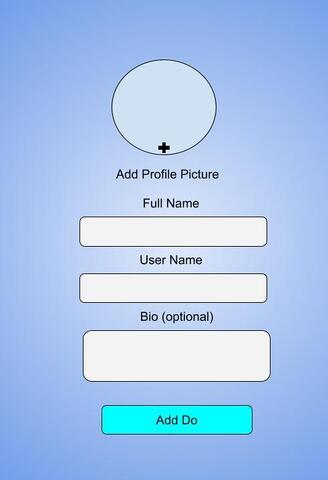

# DoggyDate
Introducing "DoggyDate," an app for dog owners to create profiles for their pets, find suitable breeding matches, or arrange playdates.
## Screenshots

## Wireframe

## Technologies Used
Javascript, Node.js, Multer, Streamifier, Cloudinary, Passport, Express, HTML, CSS, Mongoose, MongoDB, GoogleOAuth

## Deployed App
https://doggydating-c428b5defcd3.herokuapp.com/

## IceBox
1. Get notification when match happens
2. Internal Messaging
3. Improved Navigation (ex. Nav Bar)